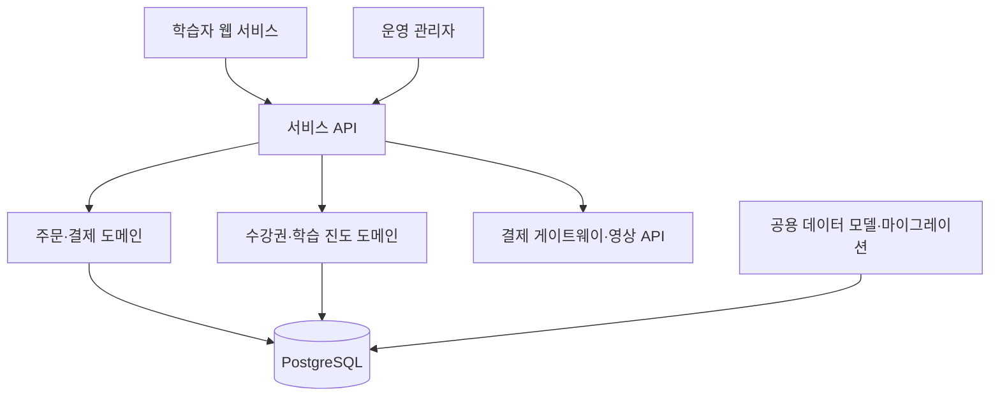
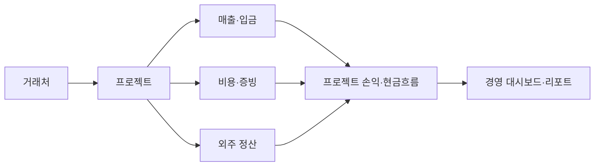
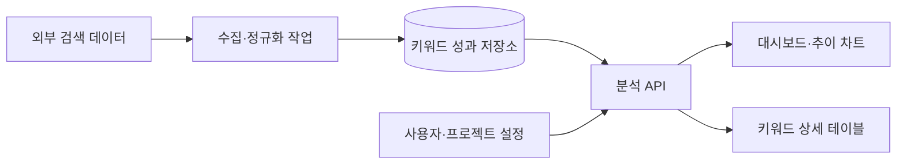

# 제이제이코드

> 복잡한 현업 문제를 데이터, 자동화, 안정적인 웹 제품으로 전환합니다.

제이제이코드는 **B2B SaaS · 이커머스 · 교육 플랫폼 · 운영 시스템**을 설계하고 구현합니다.
요구사항을 화면 단위로만 처리하지 않고, 업무 흐름·데이터 모델·권한·예외 상황·운영 도구까지 연결해 실제 사용할 수 있는 제품으로 만듭니다.

## 어떤 문제를 해결하나요

| 영역 | 제공 가치 |
| --- | --- |
| B2B SaaS | 수작업 진단·리포팅·고객 관리를 서비스화하고 운영 가능한 구조로 구축 |
| 이커머스·교육 | 상품, 결제, 쿠폰, 수강권, 콘텐츠, 환불을 일관된 도메인 규칙으로 연결 |
| 운영 시스템 | 매출·비용·프로젝트·증빙처럼 분산된 업무 데이터를 하나의 운영 흐름으로 통합 |
| 데이터 제품 | 외부 데이터를 수집·정규화·시각화하여 의사결정 가능한 대시보드로 전환 |

## 프로젝트 사례

> 아래 사례는 고객사와 제품의 고유 정보를 보호하기 위해 프로젝트명, 브랜드, 운영 수치, 화면 데이터를 일반화했습니다.

### 01. 검색 품질·광고 성과 진단 자동화 SaaS

**목표**
웹페이지를 개별적으로 점검하고 결과를 문서로 정리하던 업무를 자동화하여, 운영팀과 대행 파트너가 같은 기준으로 진단·개선·이력을 관리할 수 있는 B2B SaaS를 구축했습니다.

**제이제이코드 수행 범위**

- URL 분석부터 결과 이력, 개선 과제, 보고서, 고객·파트너 운영까지 이어지는 제품 흐름 설계
- 사용자·운영자·파트너 조직을 구분하는 역할 기반 접근 제어와 관리자 기능 구현
- 단건·다건 분석, 비동기 처리, 실패 상태 안내와 재시도 흐름 설계
- 분석 사용량 기반 크레딧 차감 및 실패 시 복구 흐름 구현
- 분석 규칙과 개선 가이드를 운영자가 변경할 수 있는 관리 도구 구축

**구현 기능**

| 기능군 | 구현 내용 |
| --- | --- |
| 분석 워크플로우 | 단일·다중 URL 접수, 분석 실행, 상태 추적, 결과 저장, 이력 비교 |
| 진단 결과 | 규칙별 통과·개선 필요 항목, 우선순위, 개선 가이드, 후속 관리 |
| 리포팅 | 분석 결과 요약, 비교 가능한 히스토리, PDF 형태의 공유용 결과물 |
| 운영 콘솔 | 회원·조직·권한·사용량·가이드·규칙·통계·감사 로그 관리 |
| 안정성 | 장시간 처리 작업의 상태 관리, 오류 관찰, 재시도·복구를 고려한 흐름 |

**기술 설계**

**적용 기술**

`Next.js` · `React` · `TypeScript` · `Supabase Auth` · `PostgreSQL` · `Row Level Security` · `Tailwind CSS` · `Vercel` · `PDF Rendering` · `Charting`

**기술적으로 집중한 지점**: 규칙 기반 분석 결과를 구조화된 데이터로 축적하고, 권한·사용량·보고서까지 일관된 운영 모델로 연결했습니다. 단순 분석 페이지가 아니라 여러 조직이 지속적으로 사용하는 SaaS 운영 체계를 목표로 설계했습니다.

---

### 02. 온라인 교육·커머스 통합 플랫폼

**목표**
교육 상품의 판매와 결제, 수강, 콘텐츠 운영, 고객 지원을 분리된 도구가 아닌 하나의 서비스 흐름으로 제공하는 플랫폼을 구축하고 지속적으로 고도화했습니다.

**제이제이코드 수행 범위**

- 사용자 서비스, 운영 관리자, 공용 데이터 모델을 분리한 멀티 저장소 구조 구성
- 상품·장바구니·주문·결제·쿠폰·포인트·환불의 도메인 규칙 구현
- 수강권 생성, 만료 시점 계산, 직접 URL 접근 차단을 포함한 학습 접근 제어 구현
- 모바일 수강 화면에서 강의 선택·재생·스크롤 흐름을 실제 사용 환경에 맞게 개선
- 운영자가 강좌·영상·게시판·주문·회원 정보를 관리할 수 있는 관리자 기능 고도화

**구현 기능**

| 기능군 | 구현 내용 |
| --- | --- |
| 고객 서비스 | 가입·로그인, 상품 탐색, 장바구니, 주문·결제, 구매 이력, 프로필 |
| 학습 경험 | 강좌 목록·상세, 영상 재생, 학습 진도, 게시판, 수강권 만료 안내 |
| 결제·환불 | 결제 완료 검증, 쿠폰·포인트 적용, 부분 취소, 결제수단별 예외 처리 |
| 운영 관리자 | 강좌·영상·상품·주문·회원·게시판 관리, 콘텐츠 선택과 게시 흐름 |
| 접근 제어 | 인증, 역할 구분, 수강 기간 확인, 만료된 강좌의 API 수준 접근 차단 |

**기술 설계**

**적용 기술**

`Next.js App Router` · `React` · `TypeScript` · `Prisma` · `PostgreSQL` · `Supabase` · `Payment SDK` · `Video SDK` · `HLS` · `Tailwind CSS` · `Vercel`

**기술적으로 집중한 지점**: 화면에서만 막는 방식이 아니라 API와 데이터 조회 조건까지 수강 기간을 적용해 접근 제어를 완성했습니다. 또한 서비스·관리자·DB를 분리해 기능 확장과 배포 책임을 명확하게 했습니다.

---

### 03. 프로젝트 손익·세무 일정 운영 시스템

**목표**
프로젝트 중심으로 매출, 비용, 외주 정산, 증빙, 세무 일정을 관리해야 하는 소규모 IT 사업자의 운영 업무를 하나의 시스템으로 통합했습니다.

**제이제이코드 수행 범위**

- 현업 업무를 거래처·프로젝트·매출·비용·외주·세무 일정 도메인으로 분해하고 데이터 모델 설계
- 화면 명세, API 명세, 데이터 스키마, 배포 구조를 문서화한 뒤 실제 기능 구현으로 연결
- 프로젝트별 손익·입금 현황을 확인하는 대시보드와 월별 리포트 구축
- 증빙 파일 보관, OCR 활용 가능성, 금액 입력 단위, 모바일 입력 흐름 등 실무 제약 반영
- Docker 기반 실행 환경과 API 문서화 체계 구성

**구현 기능**

| 기능군 | 구현 내용 |
| --- | --- |
| 기본 정보 | 거래처, 프로젝트, 계정·설정 관리 |
| 매출 관리 | 매출 발생·입금 상태, 프로젝트 연결, 현금흐름 확인 |
| 비용·증빙 | 비용 기록, 첨부 증빙, 고정 자산, 업무별 비용 분류 |
| 외주 정산 | 외주 담당자, 프로젝트 배정, 지급·정산 상태 관리 |
| 리포트 | 월별 흐름, 프로젝트 손익, 관리용 대시보드·세무 일정 |

**기술 설계**

**적용 기술**

`Next.js` · `React` · `TypeScript` · `Prisma` · `PostgreSQL` · `S3-compatible Storage` · `Zod` · `OpenAPI` · `Swagger UI` · `Docker`

**기술적으로 집중한 지점**: 회계 프로그램을 새로 만드는 대신, 프로젝트의 수익성과 현금흐름을 빠르게 판단하는 운영 도구로 범위를 명확히 했습니다. 도메인 모델과 API 계약을 먼저 정리해 기능이 늘어나도 데이터 기준이 흔들리지 않도록 설계했습니다.

---

### 04. 검색 성과 데이터 수집·시각화 플랫폼

**목표**
여러 검색 성과 지표를 주기적으로 수집하고, 프로젝트·그룹·키워드 단위의 변화를 한눈에 확인할 수 있도록 데이터 제품으로 구현했습니다.

**제이제이코드 수행 범위**

- 외부 검색 데이터 조회 결과를 서비스 내부 기준에 맞춰 저장·조회하는 흐름 구현
- 프로젝트, 키워드 그룹, 태그를 기준으로 데이터를 분류하는 관리 모델 설계
- 순위·가시성·트래픽 변화를 조회하는 대시보드와 테이블 UI 구현
- 구독형 서비스 운영을 위한 인증, 결제, 프로젝트 단위 관리 기능 구성
- 데이터 적재 구조와 API 변경에 따른 화면·백엔드 동기화 작업 수행

**구현 기능**

| 기능군 | 구현 내용 |
| --- | --- |
| 데이터 관리 | 프로젝트·그룹·태그·키워드 생성과 관리 |
| 성과 분석 | 순위, 가시성, 예상 트래픽, 기간별 변화 조회 |
| 대시보드 | 핵심 지표 요약, 추이 시각화, 키워드 단위 상세 테이블 |
| 서비스 운영 | 사용자 인증, 구독·결제, 작업 상태와 데이터 갱신 관리 |

**기술 설계**

**적용 기술**

`Next.js` · `TypeScript` · `Supabase Auth` · `Prisma` · `SQL Database` · `REST API` · `Charting` · `Vercel`

**기술적으로 집중한 지점**: 외부 데이터 API의 변화가 사용자 화면까지 오류로 이어지지 않도록 적재·조회 모델을 분리하고, 프로젝트·키워드 단위로 비교 가능한 데이터 구조를 만들었습니다.

## 공통 기술 역량

| 분야 | 전문 영역 |
| --- | --- |
| 제품 설계 | 요구사항 구조화, 사용자 흐름, 관리자 운영 흐름, 예외·권한 정책 |
| Web Frontend | Next.js, React, TypeScript, Tailwind CSS, 반응형·모바일 UX |
| Backend & Data | API 설계, PostgreSQL, Prisma, Supabase, 인증·권한·RLS, 데이터 모델링 |
| Commerce & Content | 결제 검증, 주문·쿠폰·포인트·환불, 수강권, 영상·게시판 운영 |
| Automation | 비동기 작업, 분석 규칙, 데이터 적재, 리포팅, 운영 대시보드 |
| Delivery | Vercel, Docker, 마이그레이션, 배포 흐름, 운영 모니터링 |

## 실제 운영을 고려하는 개발 방식

1. **문제를 모델링합니다.** 화면 요구사항뿐 아니라 사용자, 데이터, 권한, 상태 전이를 먼저 정리합니다.
2. **변경 가능한 구조로 만듭니다.** 관리자 도구와 명확한 API·데이터 계약을 통해 운영 중인 정책 변경에 대응합니다.
3. **예외 상황까지 구현합니다.** 결제 실패, 권한 없음, 만료 상태, 비동기 처리 실패, 데이터 변경을 제품 흐름 안에서 처리합니다.
4. **배포 이후에도 검증합니다.** 실제 화면·모바일 환경·운영 데이터 흐름을 기준으로 기능을 고도화합니다.

## 화면·데모 공개 원칙

실제 운영 화면에는 고객 식별 정보, 브랜드, 사용자 정보, 매출·주문 데이터가 포함될 수 있습니다.
이 저장소에는 이를 공개하지 않으며, 의뢰 범위와 보안 조건에 맞는 **비식별 화면 캡처 및 상세 아키텍처 자료**는 별도 협의 후 제공할 수 있습니다.

## 프로젝트 문의

다음과 같은 프로젝트를 논의할 수 있습니다.

- 신규 SaaS 또는 고객·운영자 플랫폼 구축
- 기존 관리자 시스템, 이커머스, LMS 기능 고도화
- 결제·정산·수강권·권한처럼 복잡한 비즈니스 로직 구현
- 수작업 리포팅·분석·데이터 관리 업무 자동화

---

© 제이제이코드 · Built for reliable products that solve real operational problems.
