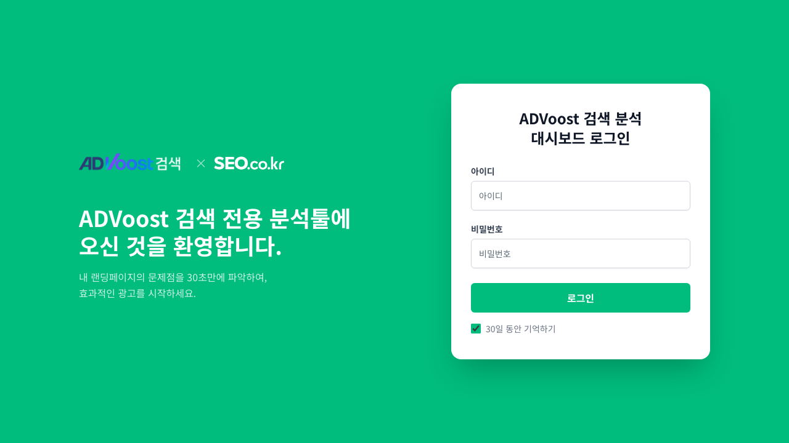
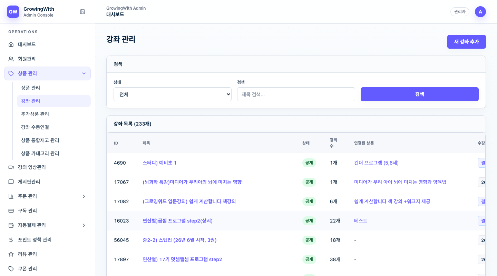
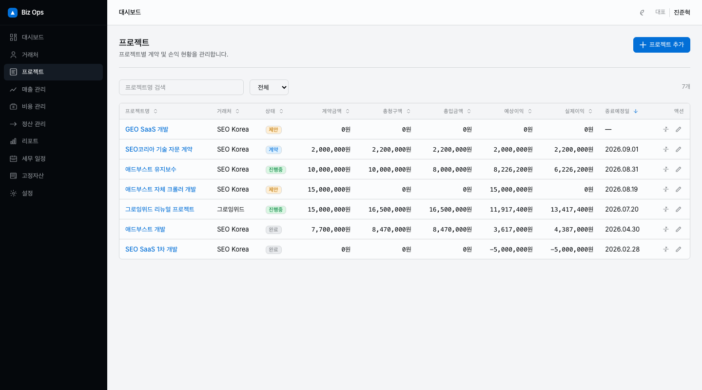
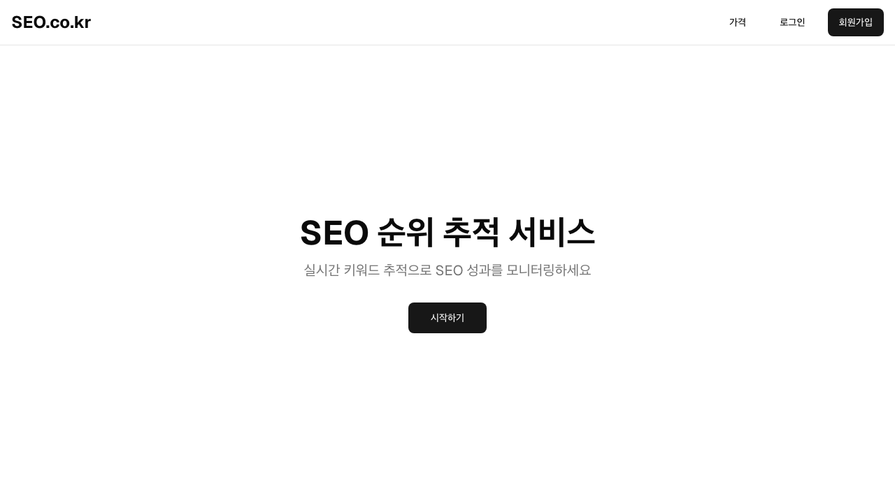

<h1 align="center">제이제이코드</h1>

<strong>복잡한 현업 문제를 데이터, 자동화, 안정적인 웹 제품으로 전환합니다.</strong>

  
  
  
  

제이제이코드는 **B2B SaaS · 이커머스 · 교육 플랫폼 · 운영 시스템 · 데이터 제품**을 설계하고 구현합니다.

요구사항을 화면 단위로만 처리하지 않습니다. 업무 흐름, 데이터 모델, 권한, 상태 전이, 예외 상황, 운영 도구까지 연결하여 실제 운영 가능한 제품을 만듭니다.

> [!NOTE]
> 아래 사례는 고객사와 제품의 고유 정보를 보호하기 위해 프로젝트명, 브랜드, 운영 수치, 화면 데이터를 일반화했습니다. 실제 화면은 기능 범위를 보여 주는 참고 자료이며, 의뢰 범위와 보안 조건에 따라 비식별 상세 자료를 별도로 제공합니다.

## 제공 가치

| 영역 | 해결하는 문제 | 제공 범위 |
| --- | --- | --- |
| **B2B SaaS** | 수작업 진단·리포팅·고객 관리가 담당자별로 흩어지는 문제 | 분석 흐름, 결과 관리, 권한, 관리자 콘솔, 리포팅 |
| **이커머스·교육** | 결제·수강·콘텐츠·고객 지원이 분리되어 운영이 복잡한 문제 | 상품, 주문, 결제, 수강권, 영상, 운영 관리자 |
| **운영 시스템** | 매출·비용·외주·증빙이 여러 문서에 분산되는 문제 | 데이터 모델, 대시보드, 정산, 문서화, API |
| **데이터 제품** | 외부 지표를 수집해도 비교·판단하기 어려운 문제 | 수집, 정규화, 저장, 조회 API, 추이 시각화 |

## 프로젝트 사례

### 01. 검색 품질·광고 성과 진단 자동화 SaaS

> **프로젝트 목표**
>
> 웹페이지를 개별적으로 점검하고 결과를 문서로 정리하던 업무를 자동화했습니다. 운영팀과 파트너 조직이 같은 기준으로 진단, 개선, 결과 이력을 관리하는 B2B SaaS 구축이 목표였습니다.

  

검색 품질·광고 성과 진단 SaaS의 접근 화면

#### 제이제이코드 수행 범위

- URL 분석부터 결과 이력, 개선 과제, 보고서, 고객·파트너 운영까지 이어지는 제품 흐름 설계
- 사용자·운영자·파트너 조직을 구분하는 역할 기반 접근 제어와 관리자 기능 구현
- 단건·다건 분석, 비동기 처리, 실패 상태 안내와 재시도 흐름 설계
- 분석 사용량 기반 크레딧 차감 및 실패 시 복구 흐름 구현
- 분석 규칙과 개선 가이드를 운영자가 변경할 수 있는 관리 도구 구축

#### 핵심 기능

| 기능군 | 구현 내용 | 실무 가치 |
| --- | --- | --- |
| 분석 워크플로우 | 단일·다중 URL 접수, 분석 실행, 상태 추적, 결과 저장, 이력 비교 | 반복 점검을 표준화하고 처리 현황을 투명하게 관리 |
| 진단 결과 | 규칙별 통과·개선 필요 항목, 우선순위, 개선 가이드, 후속 관리 | 담당자가 결과를 해석하는 시간을 줄이고 개선 행동으로 연결 |
| 리포팅 | 분석 결과 요약, 비교 가능한 히스토리, PDF 공유 자료 | 고객·내부 보고를 위한 결과물 생성 자동화 |
| 운영 콘솔 | 회원·조직·권한·사용량·가이드·규칙·통계·감사 로그 관리 | 서비스 운영 정책을 개발 배포 없이 관리 가능한 범위로 확장 |
| 안정성 | 장시간 처리 작업의 상태 관리, 오류 관찰, 재시도·복구 흐름 | 처리 실패가 곧바로 사용자 경험 저하로 이어지지 않도록 방어 |

#### 기술 설계와 구현 포인트

| 흐름 | 설계 포인트 |
| --- | --- |
| 분석 요청 → 작업 상태 | 요청 수신 직후 처리 상태를 분리해, 사용자가 대기·진행·완료·실패를 명확히 확인하도록 구성 |
| 분석 규칙 → 결과 저장 | 규칙별 결과를 구조화해 이력 비교, 가이드 연결, 통계 집계에 재사용 |
| 결과 저장 → 대시보드·보고서 | 동일한 결과 데이터를 사용자 화면, 관리자 통계, 공유용 리포트에 일관되게 사용 |
| 조직·사용자 → 권한 정책 | 사용자 역할과 소속 조직을 기준으로 조회·수정 범위를 분리 |

**적용 기술**

`Next.js` · `React` · `TypeScript` · `Supabase Auth` · `PostgreSQL` · `Row Level Security` · `Tailwind CSS` · `Vercel` · `PDF Rendering` · `Charting`

> [!TIP]
> 분석 결과를 단순 화면 출력으로 끝내지 않고, **권한·사용량·보고서·운영 정책**까지 하나의 데이터 모델로 연결한 점이 핵심입니다. 여러 조직이 계속 사용하는 서비스에서는 분석 정확도만큼 운영 가능성이 중요하다고 보았습니다.

---

### 02. 온라인 교육·커머스 통합 플랫폼

> **프로젝트 목표**
>
> 교육 상품의 판매와 결제, 수강, 콘텐츠 운영, 고객 지원을 분리된 도구가 아닌 하나의 서비스 흐름으로 제공합니다. 신규 기능 개발과 운영 중인 서비스의 모바일 UX 개선을 함께 수행했습니다.

  

교육·커머스 플랫폼의 강좌 운영·검색 화면

#### 제이제이코드 수행 범위

- 사용자 서비스, 운영 관리자, 공용 데이터 모델을 분리한 멀티 저장소 구조 구성
- 상품·장바구니·주문·결제·쿠폰·포인트·환불의 도메인 규칙 구현
- 수강권 생성, 만료 시점 계산, 직접 URL 접근 차단을 포함한 학습 접근 제어 구현
- 모바일 수강 화면에서 강의 선택·재생·스크롤 흐름을 실제 사용 환경에 맞게 개선
- 운영자가 강좌·영상·게시판·주문·회원 정보를 관리할 수 있는 관리자 기능 고도화

#### 핵심 기능

| 기능군 | 구현 내용 | 실무 가치 |
| --- | --- | --- |
| 고객 서비스 | 가입·로그인, 상품 탐색, 장바구니, 주문·결제, 구매 이력, 프로필 | 구매 전환부터 사후 관리까지 하나의 경험으로 제공 |
| 학습 경험 | 강좌 목록·상세, 영상 재생, 학습 진도, 게시판, 수강권 만료 안내 | 결제 완료 뒤 실제 학습 경험까지 자연스럽게 연결 |
| 결제·환불 | 결제 완료 검증, 쿠폰·포인트 적용, 부분 취소, 결제수단별 예외 처리 | 금액·상태 불일치를 줄이고 운영자가 처리 가능한 기준 마련 |
| 운영 관리자 | 강좌·영상·상품·주문·회원·게시판 관리, 콘텐츠 선택과 게시 흐름 | 콘텐츠 운영과 고객 지원의 반복 업무를 효율화 |
| 접근 제어 | 인증, 역할 구분, 수강 기간 확인, 만료된 강좌의 API 수준 접근 차단 | 화면 우회나 직접 링크 접근까지 고려한 학습 권한 보호 |

#### 기술 설계와 구현 포인트

| 영역 | 설계 포인트 |
| --- | --- |
| 서비스·관리자 분리 | 학습자 경험과 운영자 업무의 배포·개발 책임을 분리하고, 각각의 사용 흐름에 맞게 최적화 |
| 공용 데이터 모델 | 주문, 수강권, 강좌, 영상, 진도 정보를 동일한 스키마·마이그레이션 기준으로 관리 |
| 결제 완료 검증 | 브라우저 결과만 신뢰하지 않고 서버에서 주문 상태와 결제 정보를 검증하는 흐름 구성 |
| 수강 만료 제어 | 목록 UI뿐 아니라 상세 조회 API에도 기간 조건을 적용해 직접 URL 접근을 방지 |
| 모바일 UX | 터치 기반 강의 선택 후 재생 화면으로의 이동과 스크롤 위치를 실제 모바일 사용 흐름에 맞게 보정 |

**적용 기술**

`Next.js App Router` · `React` · `TypeScript` · `Prisma` · `PostgreSQL` · `Supabase` · `Payment SDK` · `Video SDK` · `HLS` · `Tailwind CSS` · `Vercel`

> [!TIP]
> 교육·커머스는 기능 수보다 **상태의 일관성**이 중요합니다. 주문 완료, 결제 검증, 수강권 생성, 기간 만료, 환불 처리의 연결을 데이터·API·화면 모두에서 맞추는 데 집중했습니다.

---

### 03. 프로젝트 손익·세무 일정 운영 시스템

> **프로젝트 목표**
>
> 프로젝트 중심으로 매출, 비용, 외주 정산, 증빙, 세무 일정을 관리해야 하는 소규모 IT 사업자의 운영 업무를 하나의 시스템으로 통합했습니다.

  

프로젝트별 계약·입금·수익 현황을 관리하는 운영 화면

#### 제이제이코드 수행 범위

- 현업 업무를 거래처·프로젝트·매출·비용·외주·세무 일정 도메인으로 분해하고 데이터 모델 설계
- 화면 명세, API 명세, 데이터 스키마, 배포 구조를 문서화한 뒤 실제 기능 구현으로 연결
- 프로젝트별 손익·입금 현황을 확인하는 대시보드와 월별 리포트 구축
- 증빙 파일 보관, OCR 활용 가능성, 금액 입력 단위, 모바일 입력 흐름 등 실무 제약 반영
- Docker 기반 실행 환경과 API 문서화 체계 구성

#### 핵심 기능

| 기능군 | 구현 내용 | 실무 가치 |
| --- | --- | --- |
| 기본 정보 | 거래처, 프로젝트, 계정·설정 관리 | 모든 수입·지출의 기준점을 프로젝트와 연결 |
| 매출 관리 | 매출 발생·입금 상태, 프로젝트 연결, 현금흐름 확인 | 예정 매출과 실제 입금을 구분해 자금 흐름 파악 |
| 비용·증빙 | 비용 기록, 첨부 증빙, 고정 자산, 업무별 비용 분류 | 지출 근거와 프로젝트별 비용을 함께 관리 |
| 외주 정산 | 외주 담당자, 프로젝트 배정, 지급·정산 상태 관리 | 외주 비용의 발생·지급·프로젝트 귀속을 추적 |
| 리포트 | 월별 흐름, 프로젝트 손익, 관리용 대시보드·세무 일정 | 대표가 매일 확인해야 할 운영 지표를 한곳에 제공 |

#### 기술 설계와 구현 포인트

| 영역 | 설계 포인트 |
| --- | --- |
| 도메인 모델 | 거래처 → 프로젝트 → 매출·비용·외주 정산을 연결해 손익 기준을 명확히 정의 |
| 파일·증빙 관리 | 재무 데이터와 증빙 파일을 분리하되, 업무 기록에서 함께 확인할 수 있도록 연결 |
| API 계약 | 입력·조회 규칙을 스키마로 명시하고 API 문서로 노출해 운영·확장 시 해석 차이를 축소 |
| 실행 환경 | Docker 기반 구성으로 개발·검증 환경의 재현성을 높이고 배포 준비 비용을 절감 |

**적용 기술**

`Next.js` · `React` · `TypeScript` · `Prisma` · `PostgreSQL` · `S3-compatible Storage` · `Zod` · `OpenAPI` · `Swagger UI` · `Docker`

> [!TIP]
> 범위를 회계 전체가 아닌 **프로젝트 수익성과 현금흐름을 빠르게 판단하는 운영 도구**로 명확히 했습니다. 이 경계 설정 덕분에 실제 사업 운영에 필요한 기능을 우선순위 있게 구현할 수 있었습니다.

---

### 04. 검색 성과 데이터 수집·시각화 플랫폼

> **프로젝트 목표**
>
> 여러 검색 성과 지표를 주기적으로 수집하고, 프로젝트·그룹·키워드 단위의 변화를 한눈에 확인할 수 있도록 데이터 제품으로 구현했습니다.

  

검색 성과 데이터 플랫폼의 사용자 접근 화면

#### 제이제이코드 수행 범위

- 외부 검색 데이터 조회 결과를 서비스 내부 기준에 맞춰 저장·조회하는 흐름 구현
- 프로젝트, 키워드 그룹, 태그를 기준으로 데이터를 분류하는 관리 모델 설계
- 순위·가시성·트래픽 변화를 조회하는 대시보드와 테이블 UI 구현
- 구독형 서비스 운영을 위한 인증, 결제, 프로젝트 단위 관리 기능 구성
- 데이터 적재 구조와 API 변경에 따른 화면·백엔드 동기화 작업 수행

#### 핵심 기능

| 기능군 | 구현 내용 | 실무 가치 |
| --- | --- | --- |
| 데이터 관리 | 프로젝트·그룹·태그·키워드 생성과 관리 | 다양한 분석 단위를 사용자의 업무 구조에 맞게 구성 |
| 성과 분석 | 순위, 가시성, 예상 트래픽, 기간별 변화 조회 | 단일 수치가 아니라 변화 추이로 성과 판단 |
| 대시보드 | 핵심 지표 요약, 추이 시각화, 키워드 단위 상세 테이블 | 빠른 현황 파악과 원인 탐색을 지원 |
| 서비스 운영 | 사용자 인증, 구독·결제, 작업 상태와 데이터 갱신 관리 | 데이터 서비스의 지속적 제공과 사용자별 관리 체계 확보 |

#### 기술 설계와 구현 포인트

| 흐름 | 설계 포인트 |
| --- | --- |
| 외부 데이터 → 수집 작업 | 외부 API의 응답 형식과 서비스 내부 데이터 모델을 분리해 변경 영향 최소화 |
| 수집 작업 → 성과 저장소 | 프로젝트·키워드·측정 시점을 기준으로 이력 데이터를 쌓아 기간 비교 지원 |
| 성과 저장소 → API | 대시보드와 상세 테이블이 같은 조회 기준을 사용하도록 API 계층 구성 |
| API → 사용자 화면 | 요약 지표와 상세 목록을 분리해 빠른 인식과 세부 탐색을 모두 지원 |

**적용 기술**

`Next.js` · `TypeScript` · `Supabase Auth` · `Prisma` · `SQL Database` · `REST API` · `Charting` · `Vercel`

> [!TIP]
> 데이터 제품의 신뢰성은 수집 성공 여부만으로 결정되지 않습니다. 외부 데이터 API의 변화가 사용자 화면 오류로 이어지지 않도록 **적재 모델과 조회 모델을 분리**하고 비교 기준을 명확히 했습니다.

## 공통 기술 역량

| 분야 | 전문 영역 | 대표 적용 사례 |
| --- | --- | --- |
| 제품 설계 | 요구사항 구조화, 사용자 흐름, 상태 전이, 예외·권한 정책 | SaaS 분석 흐름, 결제·수강권 정책, 프로젝트 손익 모델 |
| Web Frontend | Next.js, React, TypeScript, Tailwind CSS, 반응형·모바일 UX | 사용자 서비스, 관리자 콘솔, 데이터 대시보드 |
| Backend & Data | API 설계, PostgreSQL, Prisma, Supabase, 인증·권한·RLS | 조직별 접근 제어, 주문·수강권, 이력 데이터 |
| Commerce & Content | 결제 검증, 주문·쿠폰·포인트·환불, 수강권, 영상·게시판 | 교육·커머스 통합 플랫폼 |
| Automation | 비동기 작업, 분석 규칙, 데이터 적재, 리포팅, 운영 대시보드 | 진단 SaaS, 검색 성과 데이터 플랫폼 |
| Delivery | Vercel, Docker, 마이그레이션, 배포 흐름, 운영 모니터링 | 운영 시스템과 프로덕션 서비스 고도화 |

## 실제 운영을 고려하는 개발 방식

1. **문제를 모델링합니다.** 화면 요구사항뿐 아니라 사용자, 데이터, 권한, 상태 전이를 먼저 정리합니다.
2. **변경 가능한 구조로 만듭니다.** 관리자 도구와 명확한 API·데이터 계약을 통해 운영 중인 정책 변경에 대응합니다.
3. **예외 상황까지 구현합니다.** 결제 실패, 권한 없음, 만료 상태, 비동기 처리 실패, 데이터 변경을 제품 흐름 안에서 처리합니다.
4. **배포 이후에도 검증합니다.** 실제 화면·모바일 환경·운영 데이터 흐름을 기준으로 기능을 고도화합니다.

## 프로젝트 문의

다음과 같은 프로젝트를 논의할 수 있습니다.

- 신규 SaaS 또는 고객·운영자 플랫폼 구축
- 기존 관리자 시스템, 이커머스, LMS 기능 고도화
- 결제·정산·수강권·권한처럼 복잡한 비즈니스 로직 구현
- 수작업 리포팅·분석·데이터 관리 업무 자동화

---

© 제이제이코드 · Built for reliable products that solve real operational problems.

